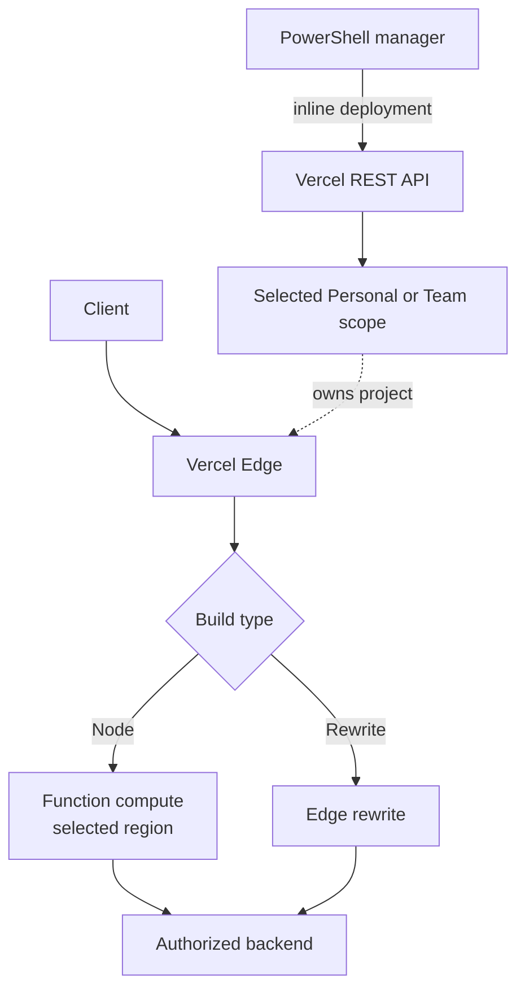
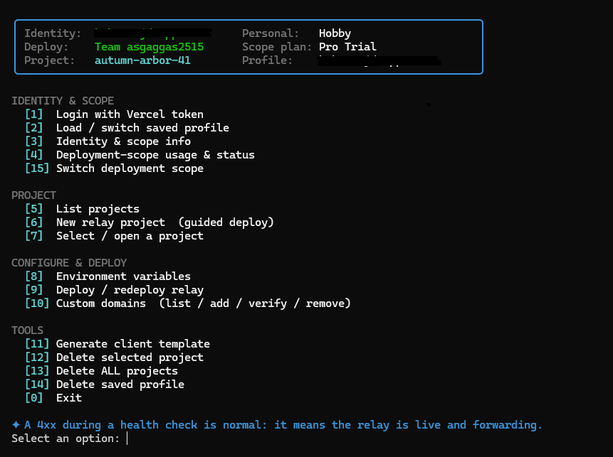

<h1 align="center">XHTTP Relay Deployer for Vercel</h1>

<p align="center">
  <strong>🚀 One menu. Correct scope. Verified region. The same workflow on every platform.</strong>
</p>

<p align="center">
  <a href="CHANGELOG.md#200---2026-07-27"></a>
  
  
  
</p>

<h3 align="center">
  <strong>📣 Follow the <a href="https://t.me/B3hnamR">B3hnamR</a> Telegram channel for release updates, setup tips, and project announcements.</strong>
</h3>

🌐 A cross-platform (**Windows, Linux, macOS**), menu-based PowerShell tool that deploys and
manages an **authorized HTTP streaming relay** (a transparent reverse proxy) on **your own**
Vercel account using the official Vercel REST API. The Linux/macOS launcher runs the **exact
same tool** under PowerShell 7 — every feature and screen is identical to Windows.

> 🛡️ **Scope & safety:** this tool only manages Personal/team scopes accessible to the API token you
> provide. It performs **no** scanning, exploitation, credential harvesting, or any
> action against third-party systems. The relay forwards traffic only to the backend you
> configure via environment variables — a backend you own or are authorized to manage.

> [!NOTE]
> 🆕 **Version 2.0.0 was built from scratch.** The previous implementation became detectable, so
> this release uses a new architecture and intentionally leaves out some legacy features. It has
> been tested successfully on Vercel **Hobby**, **Pro Trial**, and **Pro** accounts, and it currently
> works without requiring a custom domain.

---

## Quick navigation

- [Highlights](#highlights)
- [What's new in v2.0.0 vs v1.3.8](#whats-new-in-v200-vs-v138)
- [Full changelog](CHANGELOG.md)
- [Anti-ban tutorial](Anti-Ban-Tutorial.md)
- [How it fits together](#how-it-fits-together)
- [60-second quick start](#60-second-quick-start)
- [Quick setup walkthrough](#quick-setup-walkthrough)
- [Repository layout](#repository-layout)
- [Requirements](#requirements)
- [Detailed platform setup](#quick-start)
- [Menu and project tools](#menu)
- [Guided deployment flow](#example-deployment-flow-guided-menu-6)
- [Environment values](#example-environment-values)
- [Generated client template](#example-generated-client-template)
- [Build types](#build-types)
- [Vercel API reference](#vercel-api-endpoints-used-verified)
- [Troubleshooting](#troubleshooting)
- [Support the project](#support-the-project)
- [Terminal preview](#terminal-preview)

## Highlights

- 🎯 **Scope-aware by design** — Personal and team workspaces are separate, with accurate labels such
  as `Hobby`, `Pro`, and `Pro Trial` before anything is deployed.
- 📍 **Region settings that are verified** — the selected Function region is submitted both in the
  deployment payload and `vercel.json`, then checked against Vercel's deployment response.
- 🔀 **Two relay modes** — choose a streaming Node Function or a zero-compute external-origin Rewrite.
- 🧭 **Safe guided deployment** — review every value before project creation, with no empty project
  left behind when you cancel.
- 💻 **One cross-platform experience** — Windows PowerShell 5.1 and PowerShell 7 use the same manager;
  `manager.sh` is only the Linux/macOS launcher.
- 🛡️ **Operational guardrails** — encrypted profiles, explicit scope status, deployment logs, one-shot
  health checks, and protected bulk-delete confirmation.

## What's new in v2.0.0 vs v1.3.8

✨ **v2.0.0 is a from-scratch successor to [v1.3.8](https://github.com/B3hnamR/XHTTPRelayECO/tree/1.3.8).**
The previous Windows-first installer and template-based architecture were retired after that
implementation became detectable. Selected legacy presets and tools were intentionally left out
in favor of a smaller, consistent deployment path. See the
[v2.0.0 release notes](CHANGELOG.md#200---2026-07-27) for the complete change history.

| Area | v1.3.8 | v2.0.0 |
|------|--------|--------|
| 🧱 Core architecture | Windows-first installer combining repository templates, Node/npm, and the Vercel CLI. | One PowerShell manager with embedded relay files and direct inline Vercel REST API deployment. |
| 💻 Platforms | Windows launcher and Windows-focused setup. | The same manager on Windows, Linux, and macOS, plus a no-sudo PowerShell bootstrap and one-line download-and-launch command. |
| 👤 Accounts and scopes | One encrypted Windows token flow with a manually entered or saved team slug. | Multiple cross-platform encrypted profiles with API-listed Personal/team scopes that are remembered and revalidated per profile. |
| 🎛️ Deployment choices | Seven legacy preset/custom modes, landing templates, and separate routing/control options. | Two focused transparent builds: a streaming Node Function or a zero-compute external-origin Rewrite. |
| 📍 Function regions | Region selection and project configuration were available. | The chosen region is also submitted in the deployment payload, compared with Vercel's applied metadata, and checked at runtime without confusing Edge ingress with Function compute. |
| 🛡️ Project safety | Project and billing tools operated through mixed CLI/API scope discovery. | Complete team/project pagination, selected-scope usage validation, scope-status checks, an explicit pre-create review gate, and guarded bulk deletion. |
| ⚙️ Client setup | A client example was documented for manual completion. | A ready-to-use share link and JSON are generated after deployment checks; the Vercel domain works by default and verified custom domains are optional. |

> [!NOTE]
> 🧹 **Intentionally simplified:** the v1.3.8 landing-page bundle, legacy deployment-preset matrix,
> CLI-linked workflow, and selected advanced diagnostics were not carried into the rebuilt core.

## How it fits together



🧩 The manager controls deployment and the scope that owns each project; client traffic follows
only the runtime path from Vercel Edge to the build type you selected and then to your authorized
backend.

## 60-second quick start

⚡ Choose the fastest launch method for your platform.

**🪟 Windows — files already downloaded**

```powershell
.\Run-XHTTPRelayDeploy.bat
```

**🐧 Linux / macOS — download and launch in one command**

```bash
mkdir XHTTPRelayECO && curl -fsSL https://github.com/B3hnamR/XHTTPRelayECO/archive/refs/heads/master.tar.gz | tar -xz -C XHTTPRelayECO --strip-components=1 && cd XHTTPRelayECO && bash manager.sh
```

Already downloaded on Linux/macOS? Run `bash manager.sh` from the project folder.

### Quick setup walkthrough

1. 📥 **Download and launch** — on Windows, download the ZIP, extract it, and double-click
   `Run-XHTTPRelayDeploy.bat`. On Linux/macOS, paste the one-line command above into Terminal.
2. ▶️ **Let the launcher prepare the system** — Linux/macOS installs a user-local PowerShell 7
   automatically when `pwsh` is missing; no sudo is needed.
3. 🔑 **Sign in** — paste your Vercel API token when prompted.
4. 🎯 **Choose the deployment scope** — select Personal or the correct team. Press Enter to accept
   the clearly marked remembered/default choice.
5. 🚀 **Deploy** — choose **[6] Create new relay project**, enter the backend URL, and follow the
   guided prompts. Whenever a suggested value is shown, press Enter to accept it.
6. ✅ **Done** — confirm the review screen, wait for `READY`, then copy the generated client
   configuration. The Vercel-provided domain works; a custom domain is optional.

> [!TIP]
> 💡 Run the one-line installer from a folder that does not already contain `XHTTPRelayECO`.
> For every later launch, open that folder and run `bash manager.sh`.

---

## Repository layout

- 🧠 `XHTTPRelayDeploy.ps1` — the main tool (menu-driven). Same file runs on Windows and Linux/macOS.
- 🪟 `Run-XHTTPRelayDeploy.bat` — Windows double-click launcher (sets execution policy for the process only).
- 🐧 `manager.sh` — Linux/macOS launcher: ensures PowerShell 7 is present (auto-installs a user-local
  copy if missing, no sudo) and then runs the identical tool.
- 🖼️ `showcase/terminal.png` — the terminal preview shown at the bottom of this page.
- 📝 `CHANGELOG.md` — release notes, including the complete v2.0.0 change summary.
- 📖 `Anti-Ban-Tutorial.md` — the preserved Persian anti-ban setup guide.
- 📦 The relay project files are **embedded** inside the PowerShell script and uploaded inline via
  the deployment API — no Git required. The **Node** build ships `package.json` + `vercel.json` +
  `api/relay.js`; the **Rewrite** build ships `vercel.json` alone (see "Build types" below).

## Requirements

- 🪟 **Windows** 10/11 with Windows PowerShell 5.1 **or** PowerShell 7+.
- 🐧 **Linux / macOS:** nothing to pre-install — `manager.sh` installs PowerShell 7 on first run
  (or uses an existing `pwsh`). To download it the box needs `curl` or `wget`, plus `tar`.
- 🔑 A Vercel account and a Vercel **API token** (create one at
  <https://vercel.com/account/tokens>). For team projects, the token must have access to the team.
- 🌐 A backend service you control (e.g. `https://backend.example.com:8443`).

---

## Quick start

### Windows

1. 📥 Download the repository ZIP and extract it.
2. ▶️ Double-click **`Run-XHTTPRelayDeploy.bat`** (or run it from Windows Terminal).
3. 🔑 Paste your Vercel API token when prompted.
4. 🎯 Pick the deployment scope. Enter selects the remembered scope, or Vercel's default workspace
   for a new profile; every choice shows its best-effort plan (for example, `Hobby`, `Pro Trial`,
   or `Unknown` when Vercel omits billing metadata).
5. 💾 Choose whether to save the token (encrypted). The chosen scope is remembered separately.
6. 🚀 Use menu **[6] Create new relay project (guided deploy)** for the full first-run flow.

### Linux / macOS

1. ⚡ Open Terminal in the folder where you want the project, then download and launch it in one command:

   ```bash
   mkdir XHTTPRelayECO && curl -fsSL https://github.com/B3hnamR/XHTTPRelayECO/archive/refs/heads/master.tar.gz | tar -xz -C XHTTPRelayECO --strip-components=1 && cd XHTTPRelayECO && bash manager.sh
   ```

2. 🐧 On the first run it installs a user-local PowerShell 7 (no sudo) if `pwsh` isn't already
   present, then drops you into the **identical** menu. Follow steps 3–6 from Windows above.
3. 🔁 For every later launch, open the downloaded `XHTTPRelayECO` folder and run `bash manager.sh`.

   Already downloaded the files manually? Run `bash manager.sh` directly from their folder.

   (Prefer a system package? `sudo apt install powershell` / `sudo dnf install powershell` /
   `brew install powershell` — if `pwsh` is on your PATH, `manager.sh` uses it and installs nothing.)

### Where the token is stored

🔐 The token is encrypted at rest (it is **never printed or logged**), under a per-user config
folder. The encryption method depends on the OS:

| OS | Location | Encryption |
|---|---|---|
| Windows | `%USERPROFILE%\.xhttp-relay\profiles\<name>.dat` | **DPAPI** — decryptable only by the same Windows user on the same machine. |
| Linux / macOS | `~/.xhttp-relay/profiles/<name>.dat` | **AES-256** with a per-user random key in `~/.xhttp-relay/profiles/.vaultkey` (file mode `600`, owner-only). |

🛡️ Windows DPAPI binds the encrypted token to the same Windows user on the same machine. On Linux
and macOS, protection comes from AES encryption plus owner-only filesystem permissions; it is
**not** cryptographically bound to that user or machine. Anyone who obtains both a profile's
`.dat` file **and** `.vaultkey` can decrypt the token. Keep both files private, never commit or
share the profile directory, and treat backups containing both files as secrets. A privileged
administrator or malware running as your user can access locally saved credentials on any OS.

🧭 Each saved profile also has a `<name>.scope.json` sidecar in the same directory. It contains only
the last selected scope type and user/team identifiers—never the token, cached billing data, or
another secret. On load, the preference is bound to the authenticated user and a remembered team
must still appear in the token's team list. Missing, corrupt, stale, or legacy metadata causes the
normal scope picker to choose a new default after the complete team list is available. If Vercel
cannot finish that list, a missing remembered team is not guessed: selection stays unset until you
retry login or menu [15]. Deleting a profile removes both files.

### Identity, Personal plan, and deployment scope

👤 A Vercel token authenticates a **user identity**; it does not have one global plan. The same user
can have a Personal `Hobby` workspace and access to a team on `Pro Trial`. The selected deployment
scope determines project ownership, billing/limits, regions, permissions, environment variables,
domains, logs, and every create/delete operation.

The status panel therefore shows these separately:

```text
Identity:    personal-user          Personal:   Hobby
Deploy:      Team example-team      Scope plan: Pro Trial
Project:     (none selected)        Profile:    personal-user
```

Use menu **[15] Switch deployment scope** at any time. Changing scope clears the selected project
so an action cannot accidentally reuse a project ID from another workspace.

---

## Menu

```
[1]  Login with Vercel token         [8]  Configure environment vars
[2]  Load / switch saved profile     [9]  Deploy or redeploy relay code
[3]  Identity & scope info           [10] Custom domains (list/add/verify/remove)
[4]  Deployment-scope usage/status   [11] Generate client template
[5]  List projects                   [12] Delete selected project
[6]  Create new relay project        [13] Delete ALL projects
[7]  Select existing project         [14] Delete saved profile
[15] Switch deployment scope         [0]  Exit
```

📊 **Deployment-scope usage & status (menu [4]).** Reads Vercel's billing-cycle usage summary and
prints the same numbers as the dashboard — Fast Data/Origin Transfer, Edge Requests, Function Invocations,
Edge Request CPU Duration, Fluid Provisioned Memory, Fluid Active CPU, Microfrontends Routing,
and ISR Reads/Writes — each as `used / limit`, plus plan status and the current billing cycle.
The dashboard endpoint silently defaults to the user's default team when Personal is selected;
the tool detects that mismatch and discards those team metrics instead of labeling them Personal.

⚠️ **Delete ALL projects (menu [13]).** Bulk-deletes **every** project in the current scope
(personal account or selected team). It lists them first, then requires both a yes/no
confirmation and typing the exact phrase `DELETE ALL` before anything is removed. If any project
page fails or repeats a cursor, the tool refuses bulk deletion rather than treating a partial list
as complete. Irreversible.

🧰 **Project actions submenu.** Choosing **[7] Select existing project** lists your projects and,
as soon as you pick one, drops you straight into an actions menu for it — no hunting through
the main menu:

```
--- Project actions :: harbor-router-944 ---
    id:  prj_...
    url: https://harbor-router-944.vercel.app
 [1] Configure environment variables   [4] Generate client config
 [2] Deploy / redeploy relay code       [5] Run health check
 [3] Custom domains (list/add/verify/remove)  [6] Delete this project
                                        [0] Back to main menu
```

### Token profiles (multiple Vercel accounts)

🔐 Saved tokens are **named profiles**, so you can keep several Vercel identities side by side and
switch without re-pasting tokens. The `.dat` token file uses DPAPI on Windows or AES-256 on
Linux/macOS. Menu **[2] Load / switch saved profile** lists them; menu **[14]** deletes one. Each
profile remembers whether Personal or a team was last selected and makes that the next picker's
default after verifying the user and current team access. You can always override it. An existing
single `token.dat` from an older version is **auto-migrated** to a profile named `default`; its
first successful scope choice creates the new preference sidecar automatically.

### Custom domains submenu (menu [10])

🌐 Domains are managed from one submenu — **list** every domain on the project (the
auto-assigned `*.vercel.app` host is tagged and protected), **add** a custom domain,
**check / verify** one, and **remove** a custom domain you no longer want. Removal uses
`DELETE /v9/projects/{id}/domains/{name}`; the Vercel host itself cannot be removed.

### Served-region readout

📍 The post-deploy / menu health check **decodes the `x-vercel-id` header** and prints the
request's **Edge ingress** region and, for a Node deployment, its **Function compute** region. A
two-region value such as `fra1::iad1::...` means the request entered through Frankfurt but
the function ran in Washington, D.C.; a Rewrite build normally has only the edge region.
This runtime readout complements the post-deploy API check, which verifies that the
deployment's `regions` field contains the region(s) requested by the tool.

🧹 **Clean navigation.** Each menu choice runs on a freshly-cleared screen, so you only ever
see the output of the action you just picked. When it finishes, the tool waits on
`Press Enter to continue...`; pressing Enter clears that output and redraws the menu. This
applies to the main menu and both sub-menus (project actions, environment variables), so a
result like a domain-status check never scrolls off into a wall of old text.

---

## Example deployment flow (guided, menu [6])

🧭 The guided flow **collects every setting first and creates nothing until you confirm** — so if
you quit at any prompt, **no empty project is left in your account**:

```
Run-XHTTPRelayDeploy.bat
  -> Enter Vercel token            (validated against /v2/user)
  -> Deployment scope:      Team example-team - Pro Trial  (or choose Personal - Hobby)
  -> Save token encrypted?  Y      (also remembers the selected scope)

  --- info gathering (nothing created yet) ---
  -> Project name:          [Enter to auto-generate -> e.g. meridian-gateway-204]
  -> Backend URL:           https://backend.example.com:8443
  -> Path [/api]:           /api   (the SAME path your client and 3x-ui inbound use; Enter = /api)
  -> Build type:            [1=Node function, 2=Rewrite/edge proxy]  (see "Build types" below)
       Node    -> Allow insecure TLS? Y   (Y for a self-signed backend cert)
                  maxDuration:         [suggested from plan, e.g. 300]
                  Region(s):           [auto-suggested from backend DNS/geo, e.g. fra1]
       Rewrite -> (no insecure/maxDuration/region prompts; backend needs a valid public cert)

  --- review (still nothing created) ---
  -> Review box shows the chosen build + its values
  -> Create the project and deploy with these settings? [Y/n]
        n -> "Cancelled. No project was created."  (account stays clean)
        Y -> creates project, sets env vars, deploys inline files, writes a log

  -> Health check?          Y   (one GET confirms the relay is live + reaching the backend)
  -> Client UUID:           [paste your UUID, or Enter for a UUID-HERE placeholder]
  -> (prints a ready-to-use share link + JSON, host & path already filled in)
  -> Add custom domain?     n
  -> Public URL:            https://meridian-gateway-204.vercel.app
```

> 💡 **Why the review gate matters.** v1.3.8 collected the deployment inputs first, but continued
> into project creation as soon as collection finished. v2.0.0 adds an explicit final review and
> confirmation, so you can inspect every value and cancel before the tool touches your account.

### Auto project-name generator

🎲 Leave the project-name prompt empty and the tool proposes a realistic, unique name
(e.g. `cobalt-relay`, `meridian-gateway-204`, `sierra-edge`). Press Enter to accept,
`r` to regenerate, or type your own.

### Deployment-scope status gate

🛡️ As soon as the token validates and a deployment scope is chosen, the tool checks that selected
Personal/team workspace's `softBlock`, billing status, and `blocked` flag. It prints a clear
warning **before** deployment if the actual owning scope is paused, blocked, or suspended. A
healthy selection prints `<scope> status: active (no blocks detected)`.

### Auto maxDuration suggestion

⏱️ The tool detects the **selected deployment scope's** plan (best-effort) and suggests a
`maxDuration` that works **without** requiring Fluid compute, so deploys don't fail on a
plan-limit error. It never assumes that a team is Pro; unknown metadata uses the safest value:

| Detected plan | Suggested (safe) | With Fluid compute |
|---------------|------------------|--------------------|
| Hobby         | 60               | up to 300          |
| Pro / Pro Trial | 300            | up to 800          |
| Enterprise    | 900              | up to 800 (1800 beta) |

You can type any value at the prompt; the chosen value is shown and logged.

### Region selection (auto-hint from backend DNS/geo)

🌍 During deploy the tool resolves the backend hostname's DNS, geo-locates the IP, and suggests
the nearest Vercel function region. Example:

```
Auto hint: DNS A records for 'backend.example.com' => 203.0.113.10
Auto hint: using IP 203.0.113.10 (Germany) -> suggested region 'fra1'.

Choose Vercel Function Region(s). Enter numbers/codes separated by commas.
[1] Paris, France - eu-west-3 - cdg1
[2] Stockholm, Sweden - eu-north-1 - arn1
[3] Dublin, Ireland - eu-west-1 - dub1
[4] London, United Kingdom - eu-west-2 - lhr1
[5] Frankfurt, Germany - eu-central-1 - fra1 (suggested)
[6] Washington, D.C., USA - us-east-1 - iad1
[7] Dubai, UAE - me-central-1 - dxb1
[C] Custom region code(s)
Select region(s) [fra1]:
```

🗺️ You can pick several (`5,6`) or enter custom valid codes (`C` → `sfo1,sin1`), subject to the
selected scope's plan limit. The chosen list is written to `vercel.json` as `"regions": [...]`
and is also sent in the inline `POST /v13/deployments` request's top-level `regions` field, so
the API deployment does not silently fall back to the project's default. The geo lookup is a
best-effort, read-only query of **your** backend IP; if it fails, the picker still works with a
default.

> **[Region limits](https://vercel.com/docs/functions/configuring-functions/region#limits):**
> Hobby supports **one configurable Function region**; it is not fixed to
> `iad1`. Pro / Pro Trial supports up to **five** Function regions, and Enterprise supports all
> available Function regions. `iad1` is merely the default for new projects when no override is
> applied. Selecting more regions than the plan allows makes Vercel reject the deployment before
> the build step.
>
> **Verification:** after creation, the tool compares the deployment API's returned `regions`
> list with the requested list. A missing API field produces an unverified warning; an explicit
> mismatch is an error. Either case prevents generation of a ready-to-use client config. The
> health probe still runs for diagnostics and decodes `x-vercel-id`: for a Node function, the
> second region is labeled **Function compute** while the first is labeled **Edge ingress**. This
> prevents a nearby edge location from being mistaken for the configured Function region.

### Deploy logs

📝 Every deploy writes a timestamped log to:

```
<folder containing the script>\logs\deploy-<project>-<YYYYMMDD-HHmmss>.log
```

The log captures each step, the generated `vercel.json`, the chosen maxDuration/regions, the
deployment id/URL, the polled build states, and — crucially — the **build events / error
lines** pulled from `GET /v3/deployments/{id}/events`. When a deploy ends in `ERROR`, the
error lines are also printed to the console. The Vercel token is never written to the log.

> [!IMPORTANT]
> ⚠️ Logs and generated project snapshots do not contain the Vercel token, but they can contain
> project/deployment names, public URLs, selected paths, backend host/IP hints, or—in Rewrite
> mode—the backend origin. Review them before attaching them to an issue or sharing them publicly.

### Local copy of the deployed files

📁 The relay files are generated in memory and uploaded **inline** (base64) via the deployment
API — Vercel never pulls from your disk, so nothing needs to live in the current folder to
deploy. For convenience, each deploy **also writes the exact files** it uploaded to:

For a **Node** deployment, the snapshot is:

```
<folder containing the script>\projects\<project>\
  package.json
  vercel.json
  api\relay.js
```

For a **Rewrite** deployment, the same project folder contains only `vercel.json`.

These are BOM-free UTF-8, byte-identical to what was deployed — handy for inspection, diffing,
or committing to your own repo. They are *outputs*, not inputs: editing them does not change a
future deploy (the script regenerates them from your env/settings each time).

### Post-deploy health check

🩺 After a `READY` build (and from the project-actions menu, option [5]), the tool offers a
**health check**: one harmless `GET` to `https://<your-relay>/`, with a plain-language reading:

| Result | Meaning |
|---|---|
| HTTP 2xx/4xx without `x-vercel-error` | Relay is **live** and reached your backend (a plain GET isn't a real client handshake, so 4xx is normal). |
| `502 Bad Gateway` | Relay is up, but the **backend is unreachable** — check `BACKEND_URL` host/port, firewall, or set `ALLOW_INSECURE=1` for self-signed TLS. |
| `500` / `FUNCTION_INVOCATION_FAILED` | The **function crashed** — check env vars / the deploy log. |
| `x-vercel-error` or HTTP redirect | Vercel returned a platform/protection response; this does **not** prove the relay reached the backend. |
| No response / timeout | DNS may not be propagated yet, a cold start may be in progress, or the backend/network may be unresponsive — wait ~30s and retry. |

📍 The response's `x-vercel-id` is decoded into **Edge ingress** and, when present,
**Function compute**, so the function's runtime region is not confused with the request's edge
location.

## Example environment values

| Key              | Example value                              | Notes                                       |
|------------------|--------------------------------------------|---------------------------------------------|
| `BACKEND_URL`    | `https://backend.example.com:8443`         | Origin only (scheme + host + port).         |
| `RELAY_PATH`     | `/api`                                     | The single path; client = inbound (visible).|
| `ALLOW_INSECURE` | `1`                                        | `1` skips backend TLS verify (self-signed). |

### One path: client = inbound (no rewriting)

🔗 The relay forwards the request path to the backend **unchanged**, so there is exactly **one**
path value — the one your client sends **and** the one your 3x-ui / Xray inbound listens on.
They are the **same value**; you enter it once.

```
client  --->  https://relay.example.com/api/<session>  (client path = /api)
relay   forwards the path unchanged
backend <---  https://hr5...:2053/api/<session>         (3x-ui inbound path = /api)
```

- **Set the same path on both sides** (here `/api`). It's stored as `RELAY_PATH` (plain, so you
  can see it in the env list) purely as the record of that agreed value.
- If 3x-ui returns `404`, its inbound `path` doesn't match the path you configured here.

> Earlier versions had a separate `BACKEND_PATH`; it was removed because for xHTTP the client
> path and the inbound path are always identical, so two settings only invited mismatches.

### What `ALLOW_INSECURE` does

🔒 Controls whether the relay **verifies the backend's TLS certificate** when it connects out:

- **`0` (N):** verify the cert. A **self-signed** or hostname-mismatched backend cert → the
  relay→backend handshake fails → **502**.
- **`1` (Y):** skip verification — accept self-signed/mismatched certs. The traffic is still
  encrypted, just not authenticated. Use this for a typical 3x-ui box with a self-signed cert.

## Example generated client template

```
vless://<uuid>@xhttp-relay-prod.vercel.app:443?security=tls&sni=xhttp-relay-prod.vercel.app&fp=chrome&host=xhttp-relay-prod.vercel.app&type=xhttp&mode=auto&path=%2Fmypath&encryption=none#xhttp-relay-prod
```

### Auto client config after every deploy

⚙️ The moment a deploy reaches `READY`, the tool prints a **ready-to-use** config — it fills in
the host, SNI, Host header, port (443), `security=tls`, `type=xhttp`, `mode=auto`,
`fp=chrome`, and the **path you used for the build** automatically, taking the short
`https://<project>.vercel.app` host. The **only** thing it asks for is the **client UUID**:

- Paste a UUID → you get the complete share link + JSON, ready to import.
- Press Enter → the UUID field is filled with a `UUID-HERE` placeholder so you can drop in
  your real UUID later.

🌐 If the project has a **verified custom domain**, the generator offers it as the host (so the
config uses e.g. `relay.example.com` instead of `*.vercel.app`); the Vercel host stays the default.
The same zero-friction generator is also available from **project actions [4]**.

🔐 The real UUID is shown masked in the on-screen summary but appears in full inside the link and
JSON (so they actually work); the share link is printed with `Write-Host` and is **not** written
to the deploy log.

### Fully-custom template (menu [11])

🛠️ `[11] Generate client template` is the generic, fully-configurable form — scheme,
transport-type, **xHTTP mode**, and **TLS fingerprint** are all prompts (defaulting to
`xhttp` / `mode=auto` / `fp=chrome`), and you can point it at a **custom domain** instead of
the `*.vercel.app` host. Host, SNI, and Host header default to the public Vercel URL; TLS on
port 443; path defaults to the project's `RELAY_PATH`.

---

## Build types

🔀 At deploy time (guided flow **and** [9] Deploy/redeploy) the tool asks **how** to run the
relay. Both forward every path to your backend unchanged; they differ in *where* that happens.

| | **Node function** (default) | **Rewrite / edge proxy** |
|---|---|---|
| Files deployed | `package.json` + `vercel.json` + `api/relay.js` | `vercel.json` only |
| Where it runs | Serverless function (compute) | Vercel's edge network (no compute) |
| Self-signed backend cert | **OK** (`ALLOW_INSECURE=1`) | **Not supported** — needs a valid public cert |
| Backend URL | runtime env var (edit without changing code; redeploy to apply) | baked into `vercel.json` (redeploy to change) |
| `maxDuration` | applies (Hobby ~300s / Pro ~800s with Fluid) | **n/a** — no function, no Function maxDuration cap |
| Region on Hobby | one configurable Function region (`iad1` is the default) | served from the nearest edge (e.g. `fra1`) |
| Cold starts | possible | none |

💡 Pick **Rewrite** when your backend already has a trusted TLS certificate and you want the
lowest-overhead path; pick **Node** when the backend uses a self-signed cert, or you want to
swap the backend URL later without re-uploading.

### How the Node build works

```
Client --HTTPS:443--> Vercel project URL
       --> Vercel Node.js Serverless Function (api/relay.js)
       --HTTPS stream--> your backend (BACKEND_URL + original path, unchanged)
       <--streamed response-- back to the client
```

- `vercel.json` rewrites every path to `/api/relay`. A regular serverless function still
  receives the **original** request URL, so the relay forwards that path to the backend
  **unchanged** (pure passthrough — no strip/prepend).
- Body parsing is disabled (`export const config = { api: { bodyParser: false } }`) so the
  request body is streamed (`req.pipe(proxyReq)`), not buffered.
- The backend hostname is used as the **TLS SNI** (`servername`).
- The backend response is **piped** straight back (`proxyRes.pipe(res)`) — no full-response
  buffering. `host` and `accept-encoding` are removed/normalized to keep the stream clean.
- A failed backend connection returns a clean **502**.
- `maxDuration` is set per-function in `vercel.json` and shown during deploy. With Fluid
  compute (default for new projects), Hobby reaches ~300s and Pro up to 800s; lower legacy
  limits still work (Hobby 60s / Pro 300s).

### How the Rewrite build works

```
Client --HTTPS:443--> Vercel project URL
       --> Vercel Edge Network  (external-origin rewrite, no function)
       --HTTPS--> your backend (BACKEND_URL + original path, unchanged)
       <--response-- back to the client
```

- The whole project is a single `vercel.json` with an [external-origin rewrite](https://vercel.com/docs/routing/rewrites):
  `{ "source": "/(.*)", "destination": "https://<backend>/$1" }`. There is **no `api/relay.js`
  and no `package.json`** — no compute runs.
- The backend origin (scheme + host + port, path stripped) is **baked into `vercel.json`** at
  deploy time. Changing it means a redeploy.
- TLS to the backend is verified at the edge — there is **no insecure option**, so the backend
  **must present a valid, publicly-trusted certificate**.
- CDN caching of the proxied response is **disabled** via the
  `x-vercel-enable-rewrite-caching: 0` header (Vercel caches external rewrites by default since
  Apr 2026; a tunnel must never be cached). Verify with `x-vercel-cache: MISS` on a probe.
- A served-from-edge response shows a **single-segment** `x-vercel-id` (e.g. `fra1::…`), versus
  the Node build's Edge-ingress / Function-compute pair (`fra1::iad1::…`) — handy proof that no
  function executed.

## Vercel API endpoints used (verified)

<details>
<summary><strong>Show the endpoint reference</strong></summary>

<br>

| Operation                    | Method | Endpoint                                            |
|------------------------------|--------|-----------------------------------------------------|
| Validate token / current user| GET    | `/v2/user`                                          |
| List teams                   | GET    | `/v2/teams`                                         |
| List projects                | GET    | `/v9/projects`                                      |
| Create project               | POST   | `/v11/projects`                                     |
| Delete project               | DELETE | `/v9/projects/{idOrName}`                           |
| List env vars                | GET    | `/v9/projects/{idOrName}/env`                       |
| Upsert env var               | POST   | `/v10/projects/{idOrName}/env?upsert=true`          |
| Delete env var               | DELETE | `/v9/projects/{idOrName}/env/{envId}`               |
| Create deployment (inline)   | POST   | `/v13/deployments`                                  |
| Add domain                   | POST   | `/v10/projects/{idOrName}/domains`                  |
| Domain status                | GET    | `/v9/projects/{idOrName}/domains/{domain}`          |
| Verify domain                | POST   | `/v9/projects/{idOrName}/domains/{domain}/verify`   |
| Build events / logs          | GET    | `/v3/deployments/{idOrUrl}/events?builds=1`         |
| Scope plan (best-effort)     | GET    | `/v2/teams/{teamId}` · `/v2/user`                   |
| Scope usage summary          | GET    | `https://vercel.com/api/usage-summary`              |

🔌 Team-scoped requests automatically append `?teamId=...`; Personal requests do not. The usage
summary is served from the `vercel.com` dashboard host (not `api.vercel.com`) with the same bearer
token. Because that internal endpoint defaults unscoped calls to Vercel's default team, its
returned `teamId` and plan are validated against the selected scope before any metrics are shown.

</details>

---

## Troubleshooting

- 🔑 **"Failed to decrypt saved token"** —
  - *Windows:* the token file was created by a different Windows user or copied from another
    machine (DPAPI is per-user/per-machine).
  - *Linux / macOS:* the AES key file `~/.xhttp-relay/profiles/.vaultkey` is missing, was
    changed, or the vault was copied without it.
  In either case, use **[1]** to log in again and re-save.
- 🪟 **`execution of scripts is disabled`** — launch via `Run-XHTTPRelayDeploy.bat` (it uses
  `-ExecutionPolicy Bypass` for that process only).
- 🔒 **403 / "Not authorized"** on team resources — your token lacks team access, or you chose
  the wrong scope. Use **[15]** to switch scope, or reload with **[1]/[2]** if team membership
  changed. A remembered team that is no longer accessible is rejected by the scope picker.
- 🏗️ **Deployment ends in `ERROR`** — open the deploy log in `logs\deploy-<project>-<time>.log`.
  The build error lines (pulled from the deployment events endpoint) are recorded there and
  also printed to the console. The most common cause is `maxDuration` exceeding the plan limit:
  accept the tool's suggested value, lower it (60 legacy Hobby, 300 legacy Pro), or enable
  Fluid compute in the Vercel dashboard to allow higher values.
- 🌍 **Invalid region / too many regions** — region codes are validated against Vercel's list
  before deploy, so a bad custom code is ignored. Hobby supports one Function region; Pro / Pro
  Trial supports up to five. Vercel rejects a deployment that exceeds the selected plan's limit.
- 🔌 **502 Bad Gateway** — the backend is unreachable from Vercel, or the TLS certificate is
  rejected. For a self-signed backend cert, set `ALLOW_INSECURE=1` (menu [8] → [4]) and
  redeploy. Confirm `BACKEND_URL` host/port are reachable over the public internet.
- 🔎 **404 from 3x-ui / not reaching the inbound** — the path you set here must equal your 3x-ui /
  Xray inbound `path` (they are one and the same value); the client must use that same path too.
- 📶 **Streaming gets buffered / truncated** — long-lived streams are bounded by `maxDuration`.
  Raise it (Fluid compute) and/or send a periodic keep-alive from the backend. A proxy in
  front of Vercel (e.g. Cloudflare proxied mode) may re-buffer the stream.
- ♻️ **Env change has no effect** — environment variables are applied at deploy time. After
  editing env, **redeploy** (env menu → [7] Redeploy, or main menu [9]).
- 🌐 **Domain shows "verified: true" immediately but isn't live** — use **[10] Custom domains** →
  **[3] Check / verify** and the returned verification challenge / DNS records, not the initial
  add response.

---

## Support the project

💖 If XHTTP Relay Deployer has been useful to you, donations help support continued development,
testing, and maintenance.

| Asset / network | Donation address |
|-----------------|------------------|
| TRON | `TVEKp9cAU97PGfvWse7BxseeiwfCVyRef4` |
| USDT - TRC20 | `TVEKp9cAU97PGfvWse7BxseeiwfCVyRef4` |
| USDT - BEP20 | `0x34E90a9476028F15064EE8fa6aa7c1b4dDE3f480` |
| TON | `UQAuXUNyd4Sfvhm59Ef27UNC46oEBrVys5Ud7VLzqZOj5O13` |

> [!IMPORTANT]
> ⚠️ Please verify both the asset and network before sending. Blockchain transfers are irreversible.

---

## Terminal preview

<p align="center">
  
</p>

<p align="center"><sub>🖥️ The v2.0.0 terminal: identity and deployment ownership are always shown separately.</sub></p>
